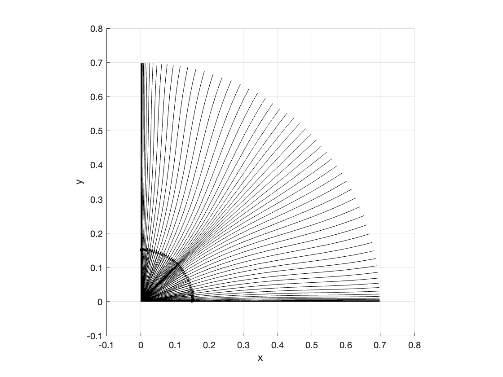
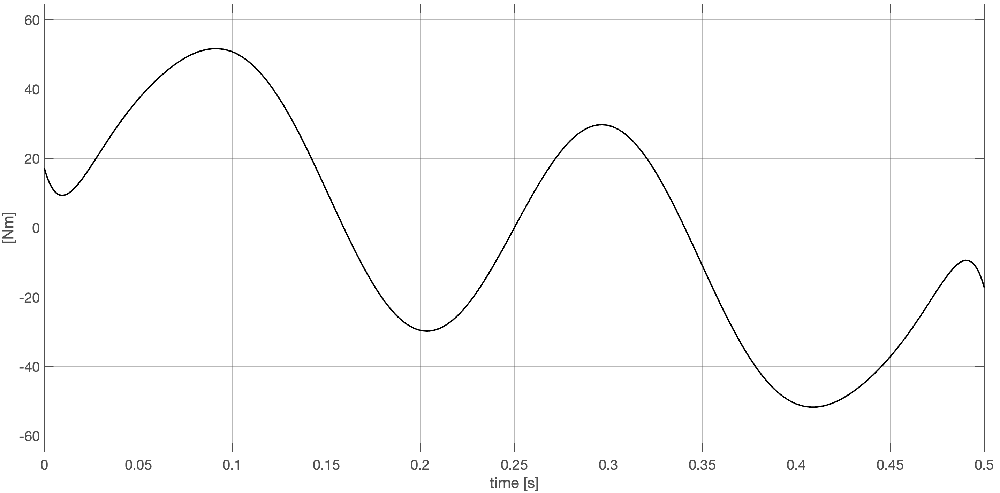
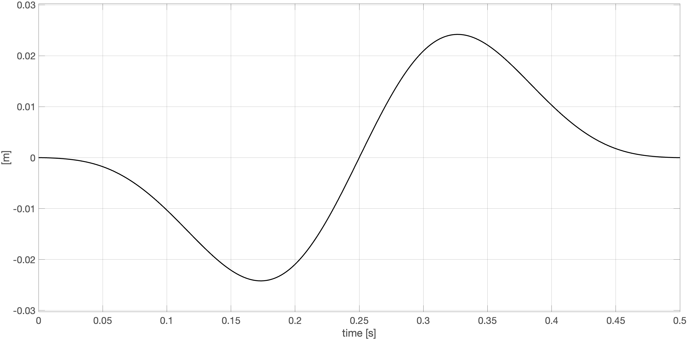
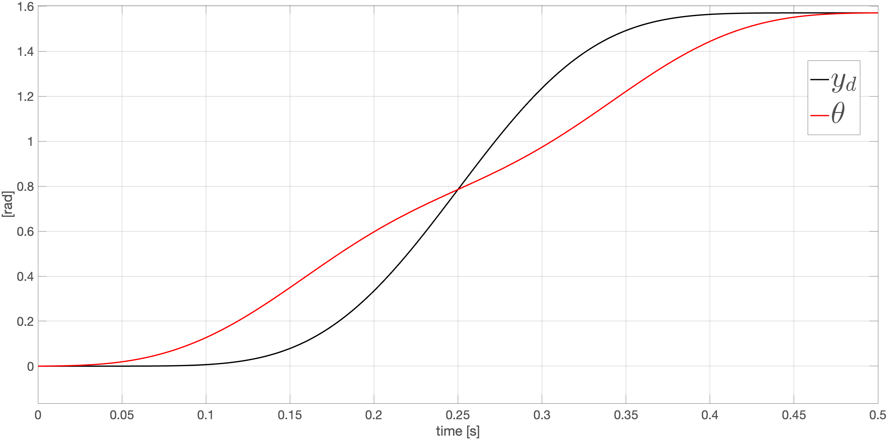

#  Rest-to-Rest Trajectory Planning of a Flexible Robot Link with Elastic Joint

The two primary sources of vibrations in lightweight robots are **link flexibility** and **joint elasticity**. Link flexibility is distributed in nature, but can be modeled as an *Euler-Bernoulli beam* with dynamic boundary conditions, using a *finite number of exact shape eigenfunctions and associated eigenfrequencies* [1]. **Joint elasticity** is usually modeled as a *concentrated effect with an elastic spring at the joint* [2].
Since the two phenomena interact and link mode shapes are also affected by the elasticity at the joint, they **must be considered together for an accurate dynamic modeling** [3]. Various control methods exist separately for the two classes of robots with link flexibility or with joint elasticity, but they are rarely combined together. *For a flexible link*, this problem has been solved using **input shaping** [4] or by defining an *output with no zero dynamics* (flat) and then applying an **inverse dynamics to a suitably planned trajectory** [5]. **In this work, we show that the latter approach can be extended also to the complete dynamic model of a one-link flexible robot with an elastic joint**.

<p align="center">
  
  
</p>

# Installation and Usage
1. Clone the repository:  
 ```sh 
 git clone "https://github.com/cybernetic-m/r2r_flexible-link_elastic-joint.git"
 ```
2. Install Matlab/Simulink 2023b (go to the following link and download it)
 ```sh 
 "https://it.mathworks.com/products/new_products/release2023b.html"
 ```
3. Open src directory
 ```sh 
 cd src
 ```

# Project Structure 

```sh 
src
├── getMode.m => Function to compute the Mode Analysis of the robot
├── getTau.m => Function to compute the needed torque command
├── getTrajectory.m => Function to plan the trajectory of the robot
├── init.m => Function to initialize the simulation
├── plotSimulation.m => Function to plot the stroboscopic view motion
├── simulation.slx => Simulink file for the simulation
```
    
# Simulations


**Stroboscopic View**




**Torque command**




**Tip Displacement**




**Angles**



# Authors


# References
[1]. [F. Bellezza, L. Lanari, and G. Ulivi, “Exact modeling of the flexible
slewing link,” in Proc. IEEE Int. Conf. on Robotics and Automation,
pp. 734–739, 1990](https://ieeexplore.ieee.org/stamp/stamp.jsp?tp=&arnumber=126073&tag=1).

[2]. [A. De Luca and W. Book, “Robots with flexible elements,” in B. Siciliano,
O. Khatib (Eds.), Springer Handbook of Robotics (2nd ed.), pp. 243–282,
Springer, 2016.](https://link.springer.com/chapter/10.1007/978-3-319-32552-1_11).

[3]. [D. Li, J.W. Zu and A.A. Goldenberg, “Dynamic modeling and mode
analysis of flexible-link, flexible-joint robots,” Mechanisms and Machine
Theory, vol. 33, no. 7, pp.1031–1044, 1998.](https://www.sciencedirect.com/science/article/pii/S0094114X97000542).

[4]. [N.C. Singer and W.P. Seering, “Preshaping command inputs to reduce
system vibration,” ASME J. of Dynamic Systems, Measurements, and
Control, vol. 112, no. 1, pp. 76–82, 1990.](https://www.academia.edu/56942661/Preshaping_command_inputs_to_reduce_system_vibration)

[5]. [A. De Luca and G. Di Giovanni, “Rest-to-rest motion of a one-link
flexible arm,” in Proc. IEEE/ASME Int. Conf. on Advanced Intelligent
Mechatronics, pp. 923–928, 2001.](https://ieeexplore.ieee.org/stamp/stamp.jsp?tp=&arnumber=936793)